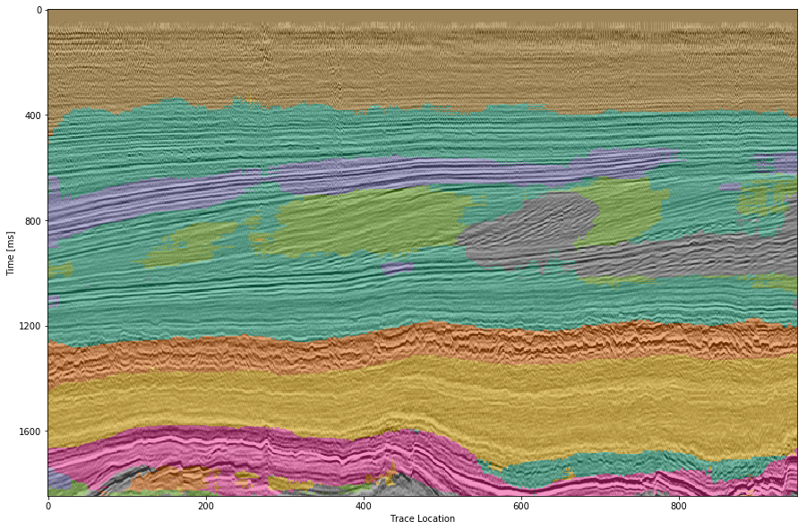
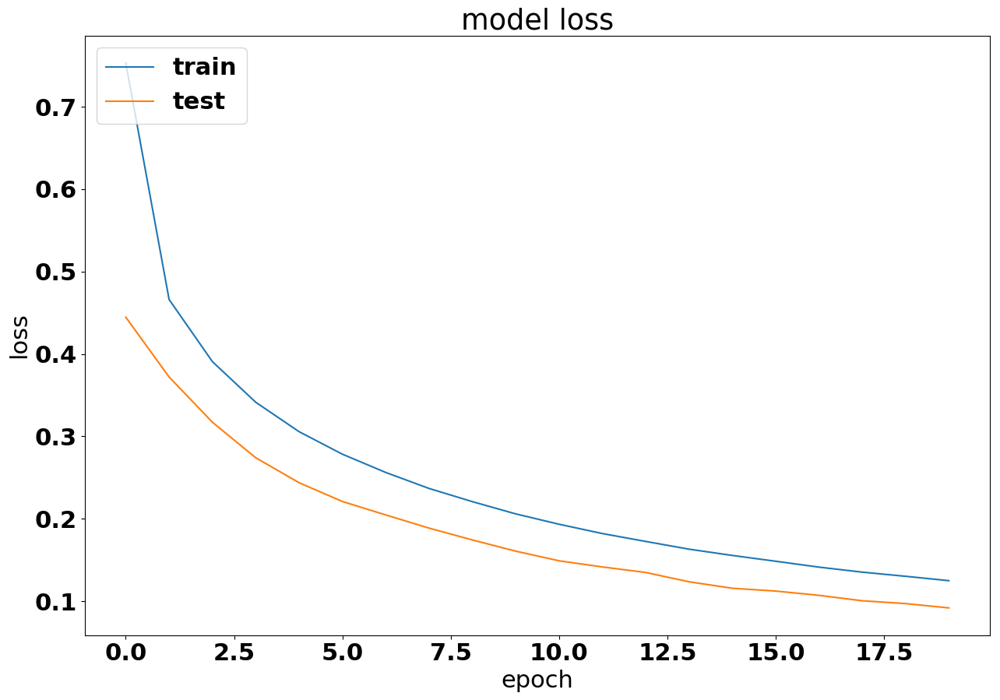

# Deep learning seismic facies on state-of-the-art CNN architectures
*[Jesper S. Dramsch](http://orcid.org/0000-0001-8273-905X), Technical University of Denmark, and Mikael Lüthje, Technical University of Denmark*

## Abstract
> We explore propagation of seismic interpretation by deep learning in stacked 2D sections. We show the application of state-of-the-art image classification algorithms on seismic data. These algorithms were trained on big labeled photograph databases. We use transfer learning to benefit from pre-trained networks and evaluate their performance on seismic data.

```
Presentation Date: Wednesday, October 17, 2018
Start Time: 8:30:00 AM
Location: 204B (Anaheim Convention Center)
Presentation Type: Oral
```
---

## Citation

### Paper
> Jesper S. Dramsch and Mikael Lüthje (2018) Deep-learning seismic facies on state-of-the-art CNN architectures. SEG Technical Program Expanded Abstracts 2018: pp. 2036-2040.

### Presentation
> Dramsch, Jesper Soeren; Lüthje, Mikael (2018): Deep-learning seismic facies on state-of-the-art CNN architectures. figshare. Presentation.
https://doi.org/10.6084/m9.figshare.7301645.v1

### Code
> Dramsch, Jesper Soeren; Lüthje, Mikael (2018): Deep-learning seismic facies on state-of-the-art CNN architectures. figshare. Code.
https://doi.org/10.6084/m9.figshare.7227545

## Usage

- Open the [Notebook](Seismic%20Classifiers-Pub.ipynb)
- Download the [F3 Seismic Data](https://terranubis.com/datainfo/Netherlands_Offshore_F3_Block_-_Complete)
- Download Models from the [Model Zoo](https://keras.io/applications/#models-for-image-classification-with-weights-trained-on-imagenet)
- Have Fun Experimenting

## Interpretation of VGG



## Loss of VGG



## References

- Abadi, M., A. Agarwal, P. Barham, E. Brevdo, Z. Chen, C. Citro, G. S. Corrado, A. Davis, J. Dean, M. Devin, S. Ghemawat, I. Goodfellow, A. Harp, G. Irving, M. Isard, Y. Jia, R. Jozefowicz, L. Kaiser, M. Kudlur, J. Levenberg, D. Mane, R. Monga, S. Moore, D. Murray, C. Olah, M. Schuster, J. Shlens, B. Steiner, I. Sutskever, K. Talwar, P. Tucker, V. Vanhoucke, V. Vasudevan, F. Viegas, O. Vinyals, P. Warden, M. Wattenberg, M. Wicke, Y. Yu, and X. Zheng, 2015, TensorFlow: Large-scale machine learning on heterogeneous systems. (Software available from tensorflow.org). 
- Baxter, J., 1998, Theoretical models of learning to learn, in Learning to learn: Springer, 71–94. 
- Charles Rutherford Ildstad, P. B., 2017, MalenoV. Machine learning of Voxels. 
- Chollet, F., et al., 2015, Keras, 
- Dahl, G. E., T. N. Sainath, and G. E. Hinton, 2013, Improving deep neural networks for LVCSR using rectified linear units and dropout: Presented at the IEEE International Conference on Acoustics Speech and Signal Processing. 
- Deng, J., W. Dong, R. Socher, L.-J. Li, K. Li, and L. Fei-Fei, 2009, ImageNet: A large-scale hierarchical image database: Presented at the CVPR09. 
- He, K., X. Zhang, S. Ren, and J. Sun, 2016, Deep residual learning for image recognition: Proceedings of the IEEE Conference on Computer Vision and Pattern Recognition, 770–778. 
- Krizhevsky, A., I. Sutskever, and G. E. Hinton, 2012, ImageNet classification with deep convolutional neural networks, in Advances in neural information processing systems: Curran Associates, Inc. 25, 1097–1105. 
- Lecun, Y., 1989, Generalization and network design strategies, in Connectionism in perspective: Elsevier. 
- Lin, T.-Y., P. Goyal, R. Girshick, K. He, and P. Dollar, 2017, Focal loss for dense object detection: arXiv preprint arXiv:1708.02002. 
- Long, J., E. Shelhamer, and T. Darrell, 2015, Fully convolutional networks for semantic segmentation: Proceedings of the IEEE Conference on Computer Vision and Pattern Recognition, 3431–3440. 
- Ruder, S., 2016, An overview of gradient descent optimization algorithms: arXiv preprint arXiv:1609.04747. 
- Rumelhart, D., G. Hinton, and R. Williams, 1988, Learning internal representations by error propagation, in Readings in cognitive science: Elsevier, 399–421. 
- Simonyan, K., and A. Zisserman, 2014, Very deep convolutional networks for large-scale image recognition: arXiv preprint arXiv:1409.1556. 
- Srivastava, N., G. Hinton, A. Krizhevsky, I. Sutskever, and R. Salakhutdinov, 2014, Dropout: A simple way to prevent neural networks from overfitting: Journal of Machine Learning Research, 15, 1929–1958. 
- Waldeland, A., and A. Solberg, 2016, 3D attributes and classification of salt bodies on unlabelled datasets: 78th Annual International Conference and Exhibition, EAGE, Extended Abstracts, https://doi.org/10.3997/2214-4609.201600880
- Widrow, B., and M. Lehr, 1990, 30&nbsp;years of adaptive neural networks: Perceptron Madaline, and backpropagation: Proceedings of the IEEE, 78, 1415–1442,  https://doi.org/10.1109/5.58323
- Yilmaz, Ö., 2001, Seismic data analysis: SEG.

## Notes
We explore transfer training for automatic seismic interpretation without fine-tuning.
See and cite the [Powerpoint](https://doi.org/10.6084/m9.figshare.7301645.v1)

---
Read More: https://library.seg.org/doi/abs/10.1190/segam2018-2996783.1
Or at: https://dramsch.net/#portfolio
